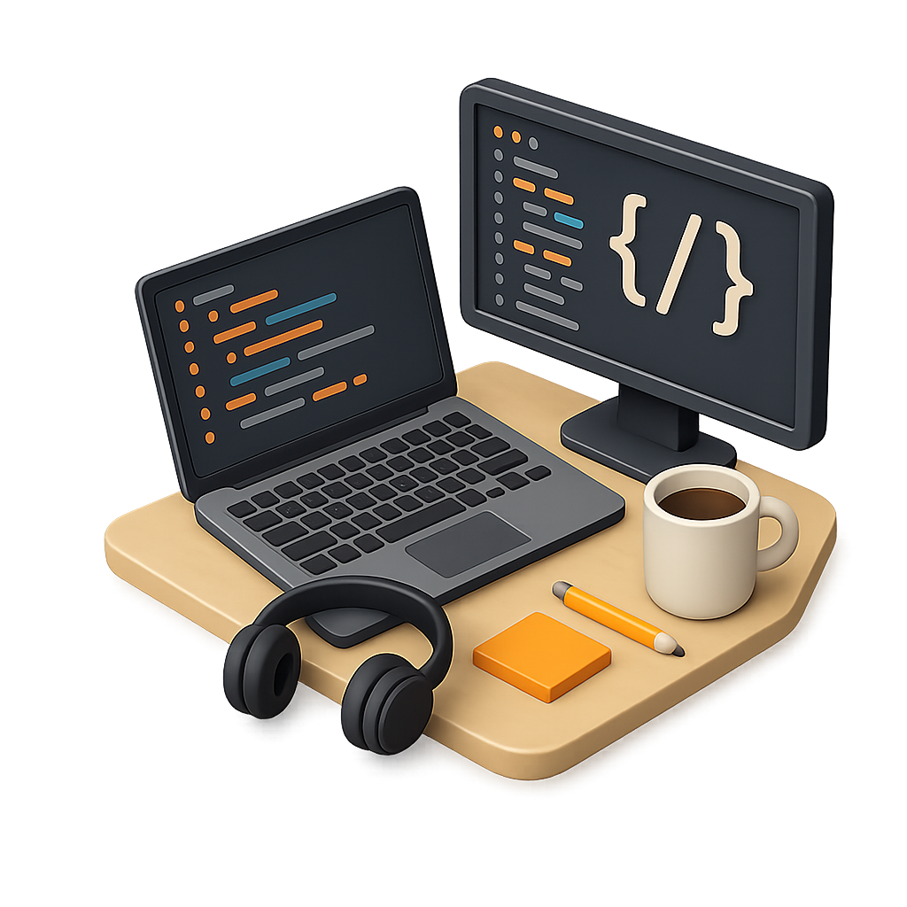

  <h1>Olá, Daniel aqui! 👋</h1>

  💻 Desenvolvedor em formação pelo If Baiano.   

<!-- -->

  
  

---
<!---->

## 🛠️ My Skills

### 🌐 Front-end:

### ⚙️ Back-end:

<!--  -->

### 🗄️ Banco de Dados:

### ☁️ Cloud & Infraestrutura:

### 🧰 Ferramentas & DevOps:

---

## 📬 Contato:

